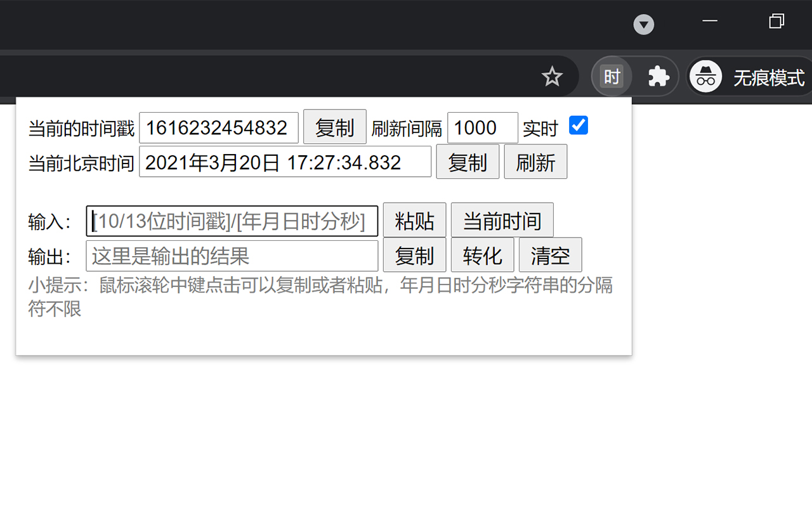
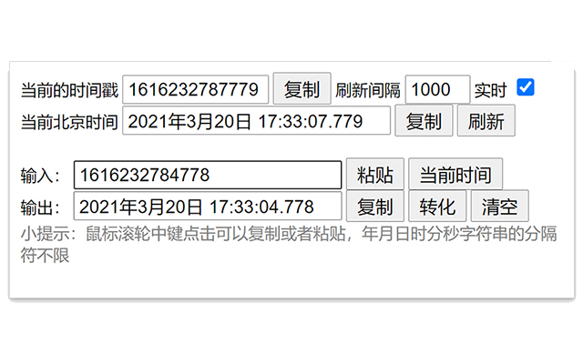
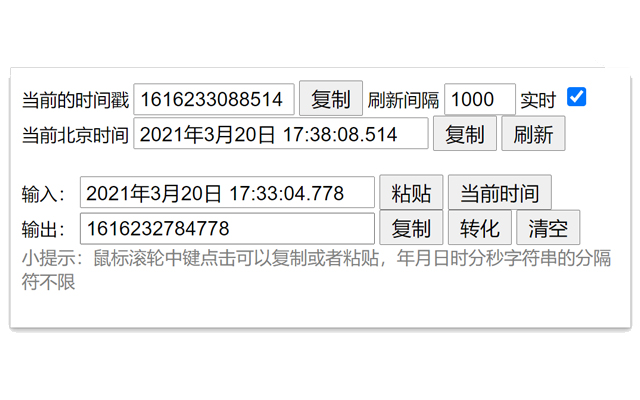
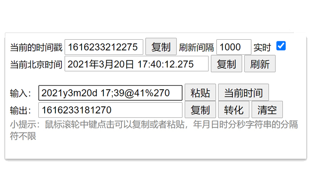
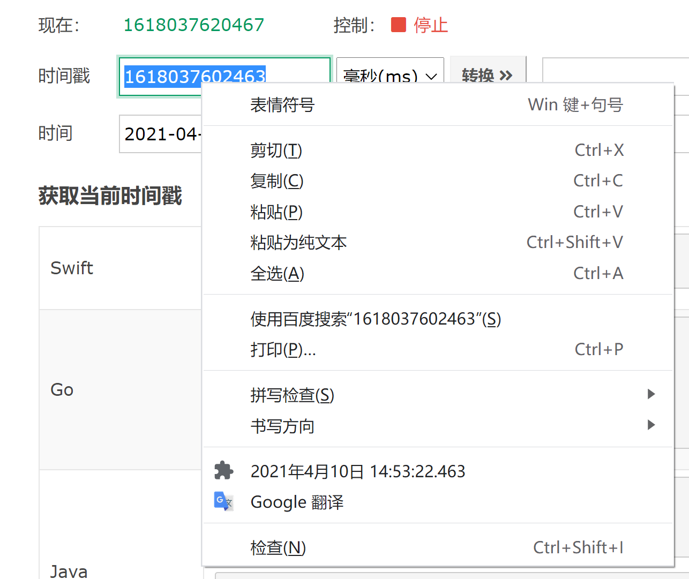
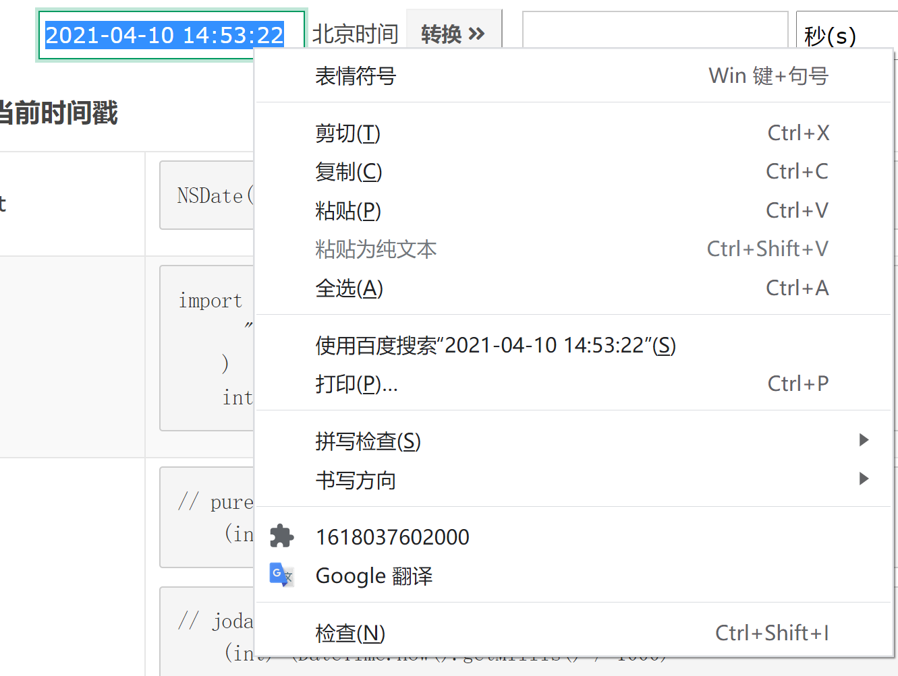

# 时间戳转换（Chrome 扩展）

一个轻量的 Chrome 扩展，用于在 **时间戳** 和 **日期时间字符串** 之间快速互转。利用 AI 重构本项目，改为 Manifest V3，优化了用户体验和性能，并增加了更多功能。

Chrome 商店地址：
[时间戳转换](https://chrome.google.com/webstore/detail/%E6%97%B6%E9%97%B4%E6%88%B3%E8%BD%AC%E5%8C%96/ahkgjgnlldlkagonpndejcbhipkealgo)

## 你可以用它做什么

- 在弹窗中输入时间戳或日期字符串，实时看到转换结果。
- 一键按当前判断模式填入时间戳，并查看当前本地时间。
- 支持 10 位、13 位、自动识别（10/13）三种判断模式。
- 在网页中选中文本后，右键菜单会显示转换结果，点击即可复制。
- 可配置是否在右键复制后弹出提示（默认关闭），以及实时刷新间隔。

## 安装方式

### 方式一：Chrome 商店安装（推荐）

直接从商店安装，自动更新。

### 方式二：本地加载源码

1. 打开 `chrome://extensions/`
2. 开启右上角「开发者模式」
3. 点击「加载已解压的扩展程序」
4. 选择项目中的 `src` 目录

## 使用说明

### 弹窗转换

1. 点击扩展图标打开弹窗
2. 在输入框中输入以下任意格式
   - `1717046400`（10 位）
   - `1717046400000`（13 位）
   - `2026-04-29 10:30:45`
   - `2026/04/29 10:30:45.123`
3. 点击 `now` 时会按当前判断模式填入时间戳（自动模式填入 13 位）
4. 在输出框查看结果并复制

### 右键菜单转换

1. 在网页上选中一段文本
2. 右键点击「时间戳转换 ...」菜单
3. 菜单会显示转换后的内容，点击后自动复制

## 权限说明

- `contextMenus`：创建和更新右键菜单
- `storage`：保存本地配置与最近一次上下文转换结果
- `clipboardRead` / `clipboardWrite`：支持弹窗读写剪贴板
- `host_permissions: <all_urls>`：在页面选区变化时更新右键菜单

> 本扩展不上传你的转换数据，配置与状态仅保存在浏览器本地存储中。

## 常见问题

### 1) 为什么有些站点右键菜单没有显示结果？

少数页面（如浏览器内部页、部分受限页面）不允许注入内容脚本，属于 Chrome 安全限制。

### 2) 输入无效日期时为什么结果为空？

扩展会对无效输入进行安全兜底，返回空结果，避免显示错误时间。

### 3) 时间戳 `0` 为什么也能转换？

`0` 是合法时间戳（Unix Epoch 起点），扩展会正常处理并可复制。

## 项目结构（给开发者）

- `src/manifest.json`：扩展清单与权限
- `src/config.js`：共享默认配置与消息常量
- `src/sw.js`：Service Worker，负责右键菜单、状态持久化与消息路由
- `src/content.js`：监听页面选区、复制和提示
- `src/popup.html`：弹窗 UI
- `src/scripts.js`：弹窗交互、配置读写与上下文消息同步
- `src/utils.js`：时间转换核心逻辑

## 截图

